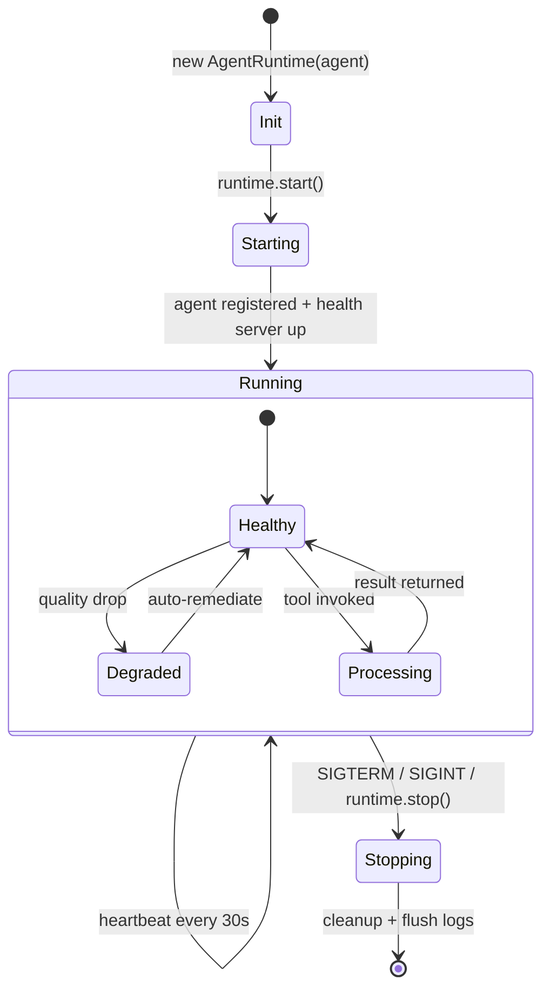

# @wave-av/adk — Agent Developer Kit

[](https://www.npmjs.com/package/@wave-av/adk)
[](https://www.npmjs.com/package/@wave-av/adk)
[](https://github.com/wave-av/adk/blob/main/LICENSE)

> **The video layer for AI agents.** Build agents that see, produce, and deliver video.

WAVE ADK is the complete toolkit for AI agents to interact with live video infrastructure. Like Stripe is for payments and Resend is for email — **WAVE is for live streaming and video**.

## Quick start

```bash
npm install @wave-av/adk
```

```typescript
import { StreamMonitorAgent } from '@wave-av/adk';

const monitor = new StreamMonitorAgent({
  apiKey: process.env.WAVE_AGENT_KEY,
  agentName: 'my-quality-monitor',
  streamIds: ['stream_abc123'],
  autoRemediate: true,
  onQualityDrop: async (alert) => {
    console.log(`Quality drop on ${alert.streamId}: ${alert.metric}`);
  },
});

await monitor.start();
```

## Agent lifecycle



**Endpoints while running:**
- `GET /health` — liveness probe (`{ status: "healthy", uptime: 12345 }`)
- `GET /ready` — readiness probe (`{ ready: true }`)
- `GET /metrics` — usage stats (`{ totalCalls: 42, totalDurationMs: 1200 }`)

## Agent templates

| Template | What It Does |
|----------|-------------|
| `StreamMonitorAgent` | Watches quality, auto-remediates degradation |
| `AutoProducerAgent` | AI-powered live show direction (camera switching, graphics) |
| `ClipFactoryAgent` | Detects highlights, auto-creates social clips |
| `ModerationAgent` | AI content moderation for chat and video |
| `CaptionAgent` | Real-time transcription and multi-language captions |

## MCP Tools (10 tools)

```typescript
import { AgentToolkit } from '@wave-av/adk/tools';

const toolkit = new AgentToolkit({ apiKey: process.env.WAVE_AGENT_KEY });

// Get MCP-compatible tool definitions
const tools = toolkit.toMCPTools();
// → wave_create_stream, wave_monitor_stream, wave_create_clip,
//   wave_switch_camera, wave_show_graphic, wave_moderate_chat,
//   wave_start_captions, wave_analyze_quality, wave_mark_highlight,
//   wave_control_camera
```

## Agent runtime v2

Production-ready lifecycle with health endpoint, heartbeat, and structured logging:

```typescript
import { StreamMonitorAgent, AgentRuntime } from '@wave-av/adk';

const agent = new StreamMonitorAgent({ /* config */ });
const runtime = new AgentRuntime(agent, {
  healthPort: 8080,           // GET /health, /ready, /metrics
  heartbeatIntervalMs: 30000, // Platform heartbeat
  logLevel: 'info',           // Structured JSON logs
});

await runtime.start(); // Handles SIGTERM/SIGINT gracefully
```

## Framework adapters

```typescript
// Mastra — native TypeScript, MCP-first
import { createMastraTools } from '@wave-av/adk/adapters/mastra';

// LangGraph — LangChain state machines
import { createLangGraphTools } from '@wave-av/adk/adapters/langgraph';

// LiveKit Agents — real-time voice/video
import { createLiveKitWaveTools } from '@wave-av/adk/adapters/livekit';

// Kernel.sh — cloud browser automation
import { createKernelTools } from '@wave-av/adk/adapters/kernel';
```

Or use the MCP server with ANY framework:
```json
{ "wave": { "command": "npx", "args": ["@wave-av/mcp-server"] } }
```

## Why WAVE ADK?

- **10 MCP tools** — plug into Claude, Cursor, or any MCP client
- **5 agent templates** — start producing in minutes, not weeks
- **Real infrastructure** — not a wrapper, actual video processing
- **Usage-based pricing** — free tier included, pay per API call
- **Enterprise-grade** — 100M+ users, multi-region, SOC 2

## Links

- [Developer Portal](https://wave.online/developers/adk)
- [API Reference](https://docs.wave.online/adk)
- [Agent Templates](https://wave.online/developers/adk#templates)
- [Community](https://wave.agents)
