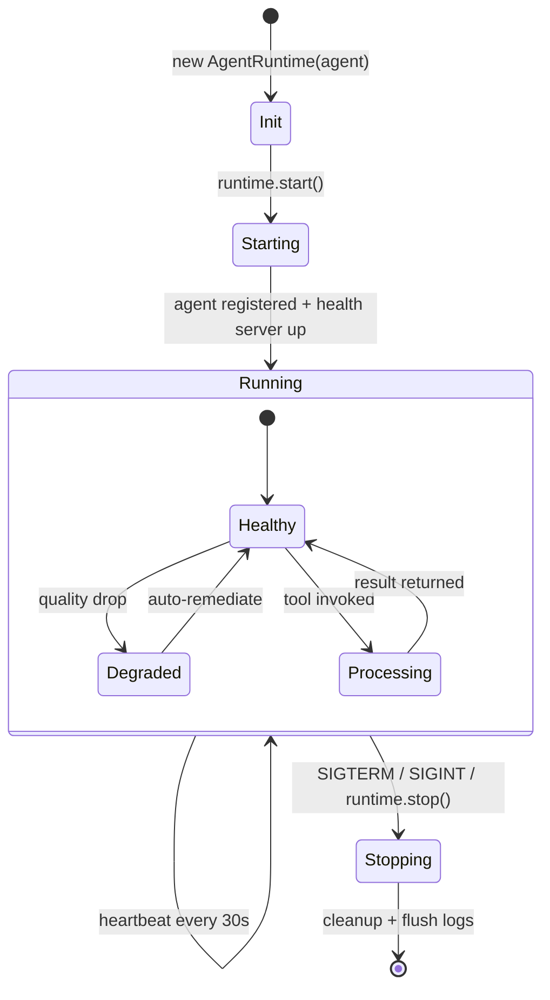

<div align="center">

# adk

**WAVE is media infrastructure for the agentic internet: one call shape moves live and on-demand media across every transport, and both kinds of user, people and agents, discover it, call it, and pay for it per call. @wave-av/adk is the agent development kit for that call shape: a TypeScript SDK with 5 ready-made agent templates, an MCP toolkit exposing 10 tools, an agent runtime (health, heartbeat, graceful shutdown), and adapters for Mastra, LangGraph, LiveKit, and Kernel.sh.**

   

[npm](https://www.npmjs.com/package/@wave-av/adk) · [homepage](https://wave.online/developers/adk) · [github](https://github.com/wave-av/adk) · [community](https://github.com/wave-av/adk/discussions) · [Docs](https://docs.wave.online) · [Status](https://wave.online/status)

</div>

> This README is machine-generated from WAVE's grounded Single Source of Truth — every
> factual claim below traces to a resolver that `npm run verify` checks against the live
> repo and live endpoints. Nothing here is asserted without a receipt.

---

## Quick start

```bash
npm install @wave-av/adk
```

```typescript
import { StreamMonitorAgent } from '@wave-av/adk';

const monitor = new StreamMonitorAgent({
  apiKey: process.env.WAVE_AGENT_KEY,
  agentName: 'my-quality-monitor',
  streamIds: ['stream_abc123'],
  autoRemediate: true,
  onQualityDrop: async (alert) => {
    console.log(`Quality drop on ${alert.streamId}: ${alert.metric}`);
  },
});

await monitor.start();
```

## Overview

Like Stripe is for payments and Resend is for email, WAVE is for media: the layer a person or an agent calls to move it, meter it, and pay for it. WAVE ADK is the agent development kit for that layer. Live video is the capability the templates cover today: agents that monitor, produce, clip, moderate, and caption a stream.

## Agent lifecycle


```mermaid
stateDiagram-v2
    [*] --> Init: new AgentRuntime(agent)
    Init --> Starting: runtime.start()
    Starting --> Running: agent registered + health server up
    Running --> Running: heartbeat every 30s
    Running --> Stopping: SIGTERM / SIGINT / runtime.stop()
    Stopping --> [*]: cleanup + flush logs

    state Running {
        [*] --> Healthy
        Healthy --> Degraded: quality drop
        Degraded --> Healthy: auto-remediate
        Healthy --> Processing: tool invoked
        Processing --> Healthy: result returned
    }
```

## Runtime endpoints

**Endpoints while running:**
- `GET /health` — liveness probe (`{ status: "healthy", uptime: 12345 }`)
- `GET /ready` — readiness probe (`{ ready: true }`)
- `GET /metrics` — usage stats (`{ totalCalls: 42, totalDurationMs: 1200 }`)

## Status

Beta. The core SDK is real and implemented: 5 agent templates, the 10-tool MCP toolkit, AgentRuntime's health/heartbeat/shutdown lifecycle, and the four framework adapters all exist as working source in src/, with test files under src/__tests__/ (though no test script or CI gate currently runs them). Two README-advertised surfaces are not yet delivered, however: the 6 tree-shakeable subpath exports (only the root "." is declared in package.json's exports map), and the wave-adk CLI binary (the build now compiles src/cli/index.ts and bin points at ./dist/cli/index.js, but no published release includes it yet). Both are marked planned rather than ga to keep this SSOT honest. The README's '$19/month usage-based pricing' claim is marketing copy with no billing config in this repo to verify it against, so it is omitted from claims here.

## Agent templates

| Template | What It Does |
| --- | --- |
| `StreamMonitorAgent` | Watches quality, auto-remediates degradation |
| `AutoProducerAgent` | AI-powered live show direction (camera switching, graphics) |
| `ClipFactoryAgent` | Detects highlights, auto-creates social clips |
| `ModerationAgent` | AI content moderation for chat and video |
| `CaptionAgent` | Real-time transcription and multi-language captions |

## MCP tools (10 tools)

```typescript
import { AgentToolkit } from '@wave-av/adk/tools';

const toolkit = new AgentToolkit({ apiKey: process.env.WAVE_AGENT_KEY });

// Get MCP-compatible tool definitions
const tools = toolkit.toMCPTools();
// → wave_create_stream, wave_monitor_stream, wave_create_clip,
//   wave_switch_camera, wave_show_graphic, wave_moderate_chat,
//   wave_start_captions, wave_analyze_quality, wave_mark_highlight,
//   wave_control_camera
```

## Agent runtime v2 — overview

Production-ready lifecycle with health endpoint, heartbeat, and structured logging:

## Agent runtime v2

```typescript
import { StreamMonitorAgent, AgentRuntime } from '@wave-av/adk';

const agent = new StreamMonitorAgent({ /* config */ });
const runtime = new AgentRuntime(agent, {
  healthPort: 8080,           // GET /health, /ready, /metrics
  heartbeatIntervalMs: 30000, // Platform heartbeat
  logLevel: 'info',           // Structured JSON logs
});

await runtime.start(); // Handles SIGTERM/SIGINT gracefully
```

## Subpath imports (planned)

Import only what you need for smaller bundles. Note: only the root `.` entry is currently built into dist/ — the /tools, /agents, /adapters, /templates, and /types subpaths shown below are declared in the README's intended API but not yet resolvable at runtime (see Status; tracked as capability `subpath-exports`, status planned).

## Subpath imports — intended usage

```typescript
// Tools only
import { AgentToolkit, WaveToolError } from '@wave-av/adk/tools';

// Agents only
import { WaveAgent, AgentRuntime } from '@wave-av/adk/agents';

// Framework adapters only
import { createMastraTools } from '@wave-av/adk/adapters';

// Agent templates
import { StreamMonitorAgent, ClipFactoryAgent } from '@wave-av/adk/templates';

// Type definitions
import type { StreamQualityAlert, ClipHighlight } from '@wave-av/adk/types';
```

## Framework adapters usage

```typescript
// Mastra — native TypeScript, MCP-first
import { createMastraTools } from '@wave-av/adk/adapters';

// LangGraph — LangChain state machines
import { createLangGraphTools } from '@wave-av/adk/adapters';

// LiveKit Agents — real-time voice/video
import { createLiveKitWaveTools } from '@wave-av/adk/adapters';

// Kernel.sh — cloud browser automation
import { createKernelTools } from '@wave-av/adk/adapters';
```

## Framework-agnostic MCP server

Or use the MCP server with ANY framework:

## MCP server config

```json
{ "wave": { "command": "npx", "args": ["@wave-av/mcp-server"] } }
```

## Why WAVE ADK?

- **10 MCP tools** — plug into Claude, Cursor, or any MCP client
- **5 agent templates** — start producing in minutes, not weeks
- **6 subpath exports** — tree-shake to only what you need (planned — see Status)
- **Real infrastructure** — not a wrapper, actual video processing
- **Enterprise-ready** — multi-region architecture, designed for scale

(The README also advertises "usage-based pricing, plans from $19/month" — that is marketing copy with no billing config in this repo to verify it against, so it is omitted here per the SSOT grounding law; see Status.)

## Troubleshooting

**Module not found with subpath imports** — ensure `"moduleResolution": "node16"` or `"nodenext"` in your `tsconfig.json`.

**ESM required error** — ADK is ESM-first. Add `"type": "module"` to your `package.json`, or use a dynamic import (see the code sample below). CJS consumers can use `require()` — the package exports `.cjs` files via the `require` condition.

## Troubleshooting — dynamic import workaround

```typescript
const { AgentToolkit } = await import("@wave-av/adk/tools");
```

## Related packages

| Package | Description |
| --- | --- |
| @wave-av/sdk | https://www.npmjs.com/package/@wave-av/sdk — TypeScript SDK (34 API modules) |
| @wave-av/mcp-server | https://www.npmjs.com/package/@wave-av/mcp-server — MCP server for AI tools |
| @wave-av/create-app | https://www.npmjs.com/package/@wave-av/create-app — Scaffold a new agent project |
| @wave-av/cli | https://www.npmjs.com/package/@wave-av/cli — Command-line interface |

## Capabilities

| Capability | Status |
| --- | --- |
| AgentRuntime provides an HTTP health server (/health, /ready, /metrics), a 30s heartbeat loop, structured JSON logging, and graceful SIGTERM/SIGINT shutdown. |  |
| 5 ready-made agent template classes extending WaveAgent: StreamMonitorAgent, AutoProducerAgent, ClipFactoryAgent, ModerationAgent, CaptionAgent. |  |
| package.json declares a wave-adk CLI bin at ./dist/cli/index.js and the build now compiles src/cli/index.ts (see CHANGELOG Unreleased), but no published release ships the CLI yet. |  |
| Adapter functions for Mastra (createMastraTools), LangGraph (createLangGraphTools), LiveKit (createLiveKitWaveTools), and Kernel.sh (createKernelTools). |  |
| AgentToolkit.toMCPTools() exposes 10 MCP tool definitions (wave_create_stream, wave_monitor_stream, wave_create_clip, wave_switch_camera, wave_show_graphic, wave_moderate_chat, wave_start_captions, wave_analyze_quality, wave_mark_highlight, wave_control_camera). |  |
| README documents 6 tree-shakeable subpath imports (root, /tools, /agents, /adapters, /templates, /types), but package.json's exports map only declares the root "." entry, so the subpaths are not resolvable (dist/ is gitignored build output, not tracked in git). |  |

## API

| Method | Path | Does |
| --- | --- | --- |
| `GET` | `/health` | Liveness probe returning { status, uptime } while an AgentRuntime is running. |
| `GET` | `/ready` | Readiness probe returning { ready: true } while an AgentRuntime is running. |
| `GET` | `/metrics` | Usage stats returning { totalCalls, totalDurationMs } while an AgentRuntime is running. |

## For AI agents

Exposes the MCP tool `AgentToolkit.toMCPTools` over `stdio`.

## The receipts

Every claim below is checked by `npm run verify` against the live repo or endpoint — a non-`pass` verdict fails the gate.

| Claim | How it's verified |
| --- | --- |
| package.json declares a wave-adk CLI binary at ./dist/cli/index.js, built from src/cli/index.ts by the tsup build. | resolved by grepping `package.json` |
| Built as dual esm/cjs output via tsup. | resolved by grepping `package.json` |
| AgentRuntime handles SIGTERM for graceful shutdown. | resolved by grepping `src/agents/AgentRuntime.ts` |
| AgentRuntime defaults heartbeatIntervalMs to 30 seconds. | resolved by grepping `src/agents/AgentRuntime.ts` |
| License is Apache-2.0. | resolved by grepping `package.json` |
| capabilities.json declares lifecycle beta. | resolved by grepping `capabilities.json` |
| Published on npm as @wave-av/adk, currently at version 1.0.15. | resolved by grepping `package.json` |
| AgentToolkit exposes MCP tool definitions via toMCPTools(). | resolved by grepping `src/tools/AgentToolkit.ts` |

## Topics

`agents` · `sdk` · `video` · `streaming` · `mcp` · `ai` · `developer-kit` · `typescript`

---

<div align="center">

**Built by [WAVE Online, LLC](https://wave.online)** · [wave.online](https://wave.online) · [Docs](https://docs.wave.online) · [LinkedIn](https://www.linkedin.com/company/wave-online)

</div>
