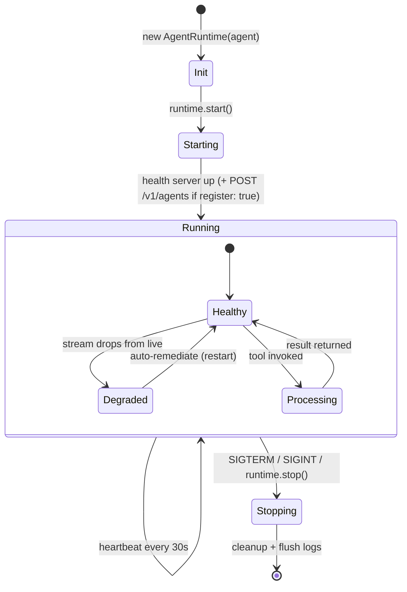

<div align="center">

# adk

**WAVE is media infrastructure for the agentic internet: one call shape moves live and on-demand media across every transport, and both kinds of user, people and agents, discover it, call it, and pay for it per call. @wave-av/adk is the agent development kit for that call shape: a TypeScript SDK with 5 ready-made agent templates, an MCP toolkit exposing 10 tools, an agent runtime (health, heartbeat, graceful shutdown), and adapters for Mastra, LangGraph, LiveKit, and Kernel.sh.**

   

[npm](https://www.npmjs.com/package/@wave-av/adk) · [homepage](https://docs.wave.online/docs/adk) · [github](https://github.com/wave-av/adk) · [community](https://github.com/wave-av/adk/discussions) · [Docs](https://docs.wave.online) · [Status](https://wave.online/status)

</div>

> This README is machine-generated from WAVE's grounded Single Source of Truth — every
> factual claim below traces to a resolver, and those resolvers are checked against the live
> repo and live endpoints in the SSOT pipeline. Nothing here is asserted without a receipt.

---

## Quick start

```bash
npm install @wave-av/adk
```

```typescript
import { StreamMonitorAgent } from '@wave-av/adk';

const monitor = new StreamMonitorAgent({
  apiKey: process.env.WAVE_AGENT_KEY!,      // a wave_live_* key from https://console.wave.online
  agentName: 'my-quality-monitor',
  streamIds: [process.env.WAVE_STREAM_ID!], // the id returned when you created the stream
  onQualityDrop: async (alert) => {
    console.log(`${alert.streamId} went ${alert.status} (${alert.metric})`);
  },
  onError: (err) => console.error(err.message),
});

await monitor.start(); // polls GET /v1/streams/{streamId}/status every 30s
```

## Registration

`start()` does not register the agent with the platform unless you pass `register: true`, which needs a key with the `agents:write` scope. Without it, the quick start makes one kind of call: `GET /v1/streams/{streamId}/status`.

## Errors

Every WAVE API call either resolves with the parsed response or throws a `WaveToolError`. A gateway error is never returned as a result. A missing key throws `WAVE_ERR_MISSING_API_KEY` in the constructor, and bad tool input throws `WAVE_ERR_VALIDATION`, both before any request is sent.

## Errors — handling a WaveToolError

```typescript
import { AgentToolkit, WaveToolError } from '@wave-av/adk/tools';

try {
  await new AgentToolkit({ apiKey: process.env.WAVE_AGENT_KEY! })
    .findTool('wave_monitor_stream')
    .handler({ streamId: process.env.WAVE_STREAM_ID! });
} catch (err) {
  if (err instanceof WaveToolError) {
    err.status;      // HTTP status, e.g. 404
    err.gatewayCode; // gateway code, e.g. ROUTE_NOT_FOUND, SCOPE_INSUFFICIENT
    err.requestId;   // quote this to support
    err.fix;         // what to do about it
  }
}
```

## What the gateway serves today

Every route the ADK calls is an operation in the WAVE API contract (`WAVE_ROUTES`, checked in CI against https://gateway.wave.online/openapi.json). Whether the live gateway serves each one is a separate question, and the answer changes as WAVE ships. From a clone of this repo, `npm run contract:live` runs the ADK against the live gateway with your own key and reports, route by route, what is served. It sends GET requests only.

Measured on 2026-09-30: the `/v1/streams` family answers `404 ROUTE_NOT_FOUND`; `/v1/clips` and `/v1/captions` answer a 402 spend-cap check that runs before route resolution (a made-up path under the same prefix gets the same 402); and the capability routes (`/v1/moderate`, `/v1/switcher`, `/v1/graphics-engine`, `/v1/replay`, `/v1/ghost-producer`, `/v1/agents`, `/v1/cameras`) answer `403 SCOPE_INSUFFICIENT` for a key without that scope. The tools surface each answer as a `WaveToolError`.

## Live contract report

```bash
npm ci && npm run build
WAVE_AGENT_KEY=wave_live_... npm run contract:live
```

## Keys and scopes

The ADK sends the key in the `Authorization: Bearer` header for you. Capability routes need that capability's write scope on the key (for example `switcher:write`); the scope list is at https://gateway.wave.online/.well-known/wave-scopes.json.

## Keys and scopes — capability routes

| Used by | Route | Scope |
| --- | --- | --- |
| `register: true`, AgentRuntime heartbeat | `POST /v1/agents` | `agents:write` |
| `wave_switch_camera`, `AutoProducerAgent.switchToSource` | `POST /v1/switcher` | `switcher:write` |
| `wave_show_graphic`, `AutoProducerAgent.showGraphic` | `POST /v1/graphics-engine` | `graphics-engine:write` |
| `AutoProducerAgent.markHighlight` | `POST /v1/replay` | `replay:write` |
| `AutoProducerAgent.start` | `POST /v1/ghost-producer` | `ghost-producer:write` |

## Overview

Like Stripe is for payments and Resend is for email, WAVE is for media: the layer a person or an agent calls to move it, meter it, and pay for it. WAVE ADK is the agent development kit for that layer. Live video is the capability the templates cover today: agents that monitor, produce, clip, moderate, and caption a stream.

## Agent lifecycle


```mermaid
stateDiagram-v2
    [*] --> Init: new AgentRuntime(agent)
    Init --> Starting: runtime.start()
    Starting --> Running: health server up (+ POST /v1/agents if register: true)
    Running --> Running: heartbeat every 30s
    Running --> Stopping: SIGTERM / SIGINT / runtime.stop()
    Stopping --> [*]: cleanup + flush logs

    state Running {
        [*] --> Healthy
        Healthy --> Degraded: stream drops from live
        Degraded --> Healthy: auto-remediate (restart)
        Healthy --> Processing: tool invoked
        Processing --> Healthy: result returned
    }
```

## Runtime endpoints

**Endpoints while running:**
- `GET /health` — liveness probe (`{ status: "healthy", uptime: 12345 }`)
- `GET /ready` — readiness probe (`{ ready: true }`)
- `GET /metrics` — usage stats (`{ totalCalls: 42, totalDurationMs: 1200 }`)

## Status

Beta. 5 agent templates, the 10-tool MCP toolkit, AgentRuntime's health/heartbeat/shutdown lifecycle, and the four framework adapters ship as source in src/, with `npm test` (vitest, mocked fetch) and a contract test run in CI. The subpath exports ship from 1.1.0, and CI imports each one in ESM and CJS. The `wave-adk` CLI ships `init` (delegates to `@wave-av/create-app`); `deploy`, `test`, `logs` and `status` exit 1 with "not implemented" until an API operation backs them. The client calls only contract operations; most of them are not yet served by the live gateway (see "What the gateway serves today"). The README's '$19/month usage-based pricing' claim is marketing copy with no billing config in this repo to verify it against, so it is omitted from claims here.

## Agent templates

| Template | What It Does |
| --- | --- |
| `StreamMonitorAgent` | Polls stream status, alerts when a live stream drops, and can restart it |
| `AutoProducerAgent` | AI-powered live show direction (camera switching, graphics, replay markers) |
| `ClipFactoryAgent` | Cuts a clip from a recording for each high-confidence highlight |
| `ModerationAgent` | Moderates each chat message and reports flag and block verdicts |
| `CaptionAgent` | Starts caption and translation jobs and downloads the captions |

## MCP tools (10 tools)

```typescript
import { AgentToolkit } from '@wave-av/adk/tools';

const toolkit = new AgentToolkit({ apiKey: process.env.WAVE_AGENT_KEY! });

// Get MCP-compatible tool definitions
const tools = toolkit.toMCPTools();
// → wave_create_stream, wave_monitor_stream, wave_create_clip,
//   wave_switch_camera, wave_show_graphic, wave_moderate_chat,
//   wave_start_captions, wave_analyze_quality, wave_mark_highlight,
//   wave_control_camera
```

## MCP tools — routes

| Tool | Required input | Route (contract operation) |
| --- | --- | --- |
| `wave_create_stream` | `title` | `POST /v1/streams` (createStream) |
| `wave_monitor_stream` | `streamId` | `GET /v1/streams/{streamId}/status` (getStreamStatus) |
| `wave_create_clip` | `recordingId`, `startTime`, `endTime` | `POST /v1/clips` (createClip) |
| `wave_switch_camera` | `switcherId`, `sourceId` | `POST /v1/switcher` (switcher) |
| `wave_show_graphic` | `switcherId`, `templateId` | `POST /v1/graphics-engine` (graphicsEngine) |
| `wave_moderate_chat` | `content` | `POST /v1/moderate` (moderateContent) |
| `wave_start_captions` | `videoId` | `POST /v1/captions` (createCaptionJob) |
| `wave_analyze_quality` | `streamId` | `GET /v1/streams/{streamId}/analytics` (getStreamAnalytics) |
| `wave_mark_highlight` | `streamId`, `label` | `POST /v1/streams/{streamId}/highlights` (markStreamHighlight) |
| `wave_control_camera` | `cameraId`, `type` | `POST /v1/cameras/{cameraId}/control` (controlCamera) |

## Agent runtime v2 — overview

Production-ready lifecycle with health endpoint, heartbeat, and structured logging:

## Agent runtime v2

```typescript
import { StreamMonitorAgent, AgentRuntime } from '@wave-av/adk';

const agent = new StreamMonitorAgent({ /* config */ });
const runtime = new AgentRuntime(agent, {
  healthPort: 8080,           // GET /health, /ready, /metrics
  heartbeatIntervalMs: 30000, // local heartbeat; also POST /v1/agents when the agent has register: true
  logLevel: 'info',           // structured JSON logs to stdout
  // logForwardUrl: process.env.LOG_COLLECTOR_URL, // optional: your collector's full URL
});

await runtime.start(); // Handles SIGTERM/SIGINT gracefully
```

## Subpath imports

Import only what you need. Every subpath ships in ESM and CJS with types.

## Subpath imports — usage

```typescript
// Tools only
import { AgentToolkit, WaveToolError } from '@wave-av/adk/tools';

// Agents only
import { WaveAgent, AgentRuntime } from '@wave-av/adk/agents';

// Framework adapters only
import { createMastraTools } from '@wave-av/adk/adapters';

// Agent templates
import { StreamMonitorAgent, ClipFactoryAgent } from '@wave-av/adk/templates';

// Type definitions
import type { StreamQualityAlert, ClipHighlight } from '@wave-av/adk/types';
```

## Framework adapters usage

```typescript
// Mastra — native TypeScript, MCP-first
import { createMastraTools } from '@wave-av/adk/adapters';

// LangGraph — LangChain state machines
import { createLangGraphTools } from '@wave-av/adk/adapters';

// LiveKit Agents — real-time voice/video
import { createLiveKitWaveTools } from '@wave-av/adk/adapters';

// Kernel.sh — cloud browser automation
import { createKernelTools } from '@wave-av/adk/adapters';

// One adapter only
import { createWaveMCPConfig } from '@wave-av/adk/adapters/mastra';
const mcpConfig = createWaveMCPConfig({ apiKey: process.env.WAVE_AGENT_KEY! });
```

## CLI

`wave-adk init` scaffolds a project through `@wave-av/create-app`. `deploy`, `test`, `logs` and `status` exit 1 with "not implemented": WAVE has no hosted-agent API for them yet. Run your agent with `AgentRuntime` on your own infrastructure.

## CLI — commands

```bash
npx wave-adk init stream-monitor my-agent   # runs npx @wave-av/create-app my-agent --template stream-monitor
npx wave-adk help
```

## Framework-agnostic MCP server

Or use the MCP server with ANY framework:

## MCP server config

```json
{ "wave": { "command": "npx", "args": ["@wave-av/mcp-server"] } }
```

## Why WAVE ADK?

- **10 MCP tools** — plug into Claude, Cursor, or any MCP client
- **5 agent templates** — start producing in minutes, not weeks
- **10 entry points** — the root plus subpaths (`/tools`, `/agents`, `/adapters`, `/adapters/*`, `/templates`, `/types`), so you import only what you need
- **Real infrastructure** — not a wrapper, actual video processing
- **Enterprise-ready** — multi-region architecture, designed for scale

(The README also advertises "usage-based pricing, plans from $19/month" — that is marketing copy with no billing config in this repo to verify it against, so it is omitted here per the SSOT grounding law; see Status.)

## Troubleshooting

**Module not found with subpath imports** — ensure `"moduleResolution": "node16"`, `"nodenext"` or `"bundler"` in your `tsconfig.json`; older `"node"` resolution finds the subpath types through `typesVersions`.

**ESM required error** — ADK is ESM-first. Add `"type": "module"` to your `package.json`, or use a dynamic import (see the code sample below). CJS consumers can use `require()` — the package exports `.cjs` files via the `require` condition.

## Troubleshooting — dynamic import workaround

```typescript
const { AgentToolkit } = await import("@wave-av/adk/tools");
```

## Related packages

| Package | Description |
| --- | --- |
| @wave-av/sdk | https://www.npmjs.com/package/@wave-av/sdk — TypeScript SDK (34 API modules) |
| @wave-av/mcp-server | https://www.npmjs.com/package/@wave-av/mcp-server — MCP server for AI tools |
| @wave-av/create-app | https://www.npmjs.com/package/@wave-av/create-app — Scaffold a new agent project |
| @wave-av/cli | https://www.npmjs.com/package/@wave-av/cli — Command-line interface |

## Capabilities

| Capability | Status |
| --- | --- |
| AgentRuntime provides an HTTP health server (/health, /ready, /metrics), a 30s heartbeat loop, structured JSON logging, and graceful SIGTERM/SIGINT shutdown. |  |
| 5 ready-made agent template classes extending WaveAgent: StreamMonitorAgent, AutoProducerAgent, ClipFactoryAgent, ModerationAgent, CaptionAgent. |  |
| wave-adk CLI at ./dist/cli/index.js: `init` scaffolds a project through @wave-av/create-app; `deploy`, `test`, `logs` and `status` exit 1 with "not implemented" until a WAVE API operation backs them. |  |
| Every tool and template calls a route from WAVE_ROUTES (src/routes.ts), a contract test checks each one against the vendored WAVE OpenAPI snapshot, and every non-2xx answer throws WaveToolError with the gateway code and request id. Most of those routes are not yet served by the live gateway. |  |
| Adapter functions for Mastra (createMastraTools), LangGraph (createLangGraphTools), LiveKit (createLiveKitWaveTools), and Kernel.sh (createKernelTools). |  |
| AgentToolkit.toMCPTools() exposes 10 MCP tool definitions (wave_create_stream, wave_monitor_stream, wave_create_clip, wave_switch_camera, wave_show_graphic, wave_moderate_chat, wave_start_captions, wave_analyze_quality, wave_mark_highlight, wave_control_camera). |  |
| package.json exports the root plus /tools, /agents, /adapters, /adapters/mastra, /adapters/langgraph, /adapters/livekit, /adapters/kernel, /templates and /types, each built by tsup in ESM and CJS with types; `npm run check:exports` imports every one of them in CI. |  |

## API

| Method | Path | Does |
| --- | --- | --- |
| `GET` | `/health` | Liveness probe returning { status, uptime } while an AgentRuntime is running. |
| `GET` | `/ready` | Readiness probe returning { ready: true } while an AgentRuntime is running. |
| `GET` | `/metrics` | Usage stats returning { totalCalls, totalDurationMs } while an AgentRuntime is running. |

## For AI agents

Exposes the MCP tool `AgentToolkit.toMCPTools` over `stdio`.

## The receipts

Every claim below is resolved against the live repo or endpoint by the SSOT verifier — a non-`pass` verdict fails the gate.

| Claim | How it's verified |
| --- | --- |
| package.json declares a wave-adk CLI binary at ./dist/cli/index.js, built from src/cli/index.ts by the tsup build. | resolved by grepping `package.json` |
| A contract test checks every route in WAVE_ROUTES against the vendored WAVE OpenAPI snapshot. | resolved by grepping `src/__tests__/contract.test.ts` |
| Built as dual esm/cjs output via tsup. | resolved by grepping `tsup.config.ts` |
| AgentRuntime handles SIGTERM for graceful shutdown. | resolved by grepping `src/agents/AgentRuntime.ts` |
| AgentRuntime defaults heartbeatIntervalMs to 30 seconds. | resolved by grepping `src/agents/AgentRuntime.ts` |
| License is Apache-2.0. | resolved by grepping `package.json` |
| capabilities.json declares lifecycle beta. | resolved by grepping `capabilities.json` |
| package.json version is 1.1.0 (published on npm as @wave-av/adk once the v1.1.0 tag releases it). | resolved by grepping `package.json` |
| package.json declares per-adapter subpath exports such as ./adapters/mastra. | resolved by grepping `package.json` |
| AgentToolkit exposes MCP tool definitions via toMCPTools(). | resolved by grepping `src/tools/AgentToolkit.ts` |
| Every WAVE API call goes through one request function that throws WaveToolError on a non-2xx answer. | resolved by grepping `src/http.ts` |

## Topics

`agents` · `sdk` · `video` · `streaming` · `mcp` · `ai` · `developer-kit` · `typescript`

---

<div align="center">

**Built by [WAVE Online, LLC](https://wave.online)** · [wave.online](https://wave.online) · [Docs](https://docs.wave.online) · [LinkedIn](https://www.linkedin.com/company/wave-online)

</div>

